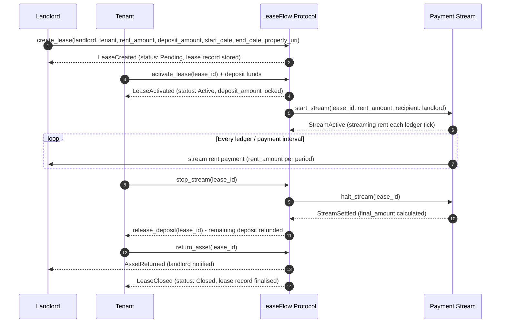

# Soroban Project

## Project Structure

This repository uses the recommended structure for a Soroban project:

```text
.
├── contracts
│   └── hello_world
│       ├── src
│       │   ├── lib.rs
│       │   └── test.rs
│       └── Cargo.toml
├── Cargo.toml
└── README.md
```

- New Soroban contracts can be put in `contracts`, each in their own directory. There is already a `hello_world` contract in there to get you started.
- If you initialized this project with any other example contracts via `--with-example`, those contracts will be in the `contracts` directory as well.
- Contracts should have their own `Cargo.toml` files that rely on the top-level `Cargo.toml` workspace for their dependencies.
- Frontend libraries can be added to the top-level directory as well. If you initialized this project with a frontend template via `--frontend-template` you will have those files already included.

## Deployed Contract
- **Network:** Stellar Testnet
- **Contract ID:** CAEGD57WVTVQSYWYB23AISBW334QO7WNA5XQ56S45GH6BP3D2AVHKUG4

## Protocol Flow

LeaseFlow manages the full lifecycle of a property lease on-chain — from creation through rent streaming to deposit settlement and lease closure. The landlord initialises the lease with terms and a deposit requirement; the tenant activates it by funding the deposit; rent streams continuously to the landlord while the lease is active; and when the lease ends the protocol calculates the final settlement, releases the remaining deposit to the tenant, and closes the record. This design keeps funds non-custodial and settlement logic transparent at every step.



### Step-by-step breakdown

1. **Landlord calls `create_lease`** — Passes tenant address, `rent_amount`, `deposit_amount`, `start_date`, `end_date`, and a `property_uri` (e.g. an IPFS link to the property listing). The protocol stores the lease record with status `Pending`.

2. **Protocol emits `LeaseCreated`** — The lease is registered in contract instance storage under the `lease` key. No funds move yet.

3. **Tenant calls `activate_lease` and funds the deposit** — The tenant transfers `deposit_amount` to the contract. The protocol validates the amount and flips the lease status to `Active`.

4. **Protocol emits `LeaseActivated`** — Deposit is locked in the contract. The lease is now live and the payment stream can begin.

5. **Protocol starts the payment stream** — Internally triggers `start_stream` with the agreed `rent_amount` rate and the landlord as recipient. The stream is tied to the lease record.

6. **Stream flows each ledger tick** — Rent is continuously streamed from the locked funds to the landlord's address at the agreed rate for the duration of the lease.

7. **Tenant signals end of lease via `stop_stream`** — Tenant calls the protocol to halt the stream, indicating they are ready to return the asset and close out.

8. **Protocol halts the stream and settles** — Calls `halt_stream` internally; the stream calculates the `final_amount` paid and reports back. Any unstreamed rent is reconciled.

9. **Protocol releases remaining deposit to tenant** — After settlement, `release_deposit` returns the unused portion of `deposit_amount` to the tenant's address.

10. **Tenant calls `return_asset`** — Signals that the physical or digital asset has been returned to the landlord. The protocol records this on-chain.

11. **Protocol closes the lease** — Emits `AssetReturned` to the landlord and `LeaseClosed` to the tenant. The lease status is set to `Closed` and the record is finalised in storage.

### Edge cases

- **Tenant never returns the asset** — If `return_asset` is not called before the `end_date` + grace period, the protocol can slash all or part of the `deposit_amount` as a penalty and mark the lease `Defaulted`. See `test_deposit_release_disputed` for the disputed-return flow.

- **Stream runs out of funds before lease ends** — If the tenant's deposited funds are exhausted before `end_date`, the stream halts automatically. The protocol records the shortfall; the landlord can claim the remaining deposit as partial compensation. See `test_deposit_release_partial_refund` for this scenario.

- **Landlord disputes the return condition** — If the landlord rejects the asset return (e.g. damage claim), the lease enters a `Disputed` state. The deposit is held in escrow until the dispute is resolved — either by on-chain arbitration logic or a manual settlement call. See `test_deposit_release_disputed` for the disputed-return snapshot.

